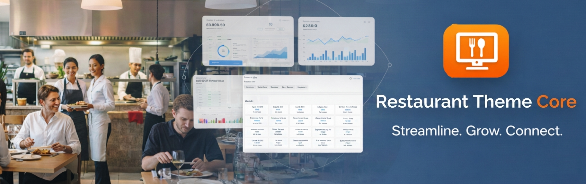
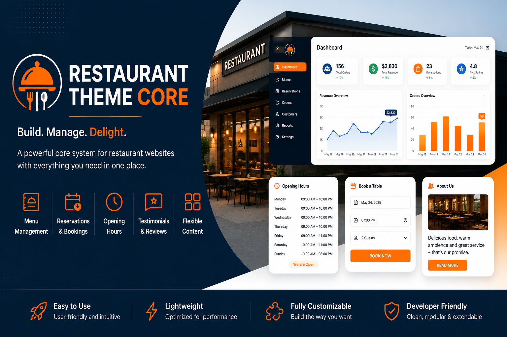
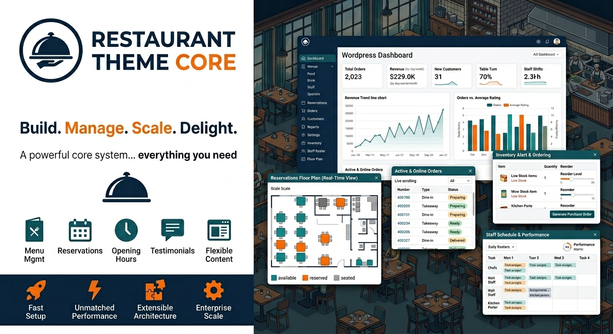

# Obydullah Restaurant Core

> A lightweight WordPress plugin that powers restaurant websites with custom post types, menu management, and a built-in reservation system.

**Obydullah Restaurant Core** is the official companion plugin for the [Obydullah Restaurant](https://wordpress.org/themes/obydullah-restaurant/) WordPress theme. It provides everything a restaurant website needs behind the scenes, custom post types for menus, testimonials, opening hours, reservations, and more, all managed from a clean admin dashboard.

Whether you are building a fine-dining site or a casual eatery, this plugin gives you the content structure without bloat. It follows WordPress coding standards, is translation-ready, and works seamlessly with the companion theme or any other restaurant theme with minor adjustments.

---

## Preview

### Admin Dashboard

A central dashboard with quick-access cards for every section: Hero Slider, Chef's Special, Menu, Testimonials, Opening Hours, Reservations, Footer, About, and Contact.

### Hero Slider Banners

| Banner Style 1                                            | Banner Style 2                                            |
| --------------------------------------------------------- | --------------------------------------------------------- |
|  |  |

Manage multiple hero slides with titles, subtitles, and featured images directly from the WordPress admin.

---

## Key Features

### Hero Slider

- Create and manage hero slides with titles, subtitles, and featured images.
- Supports page attributes for ordering and REST API for block-editor use.

### Chef's Specials

- Single-instance post type for showcasing a featured signature dish.
- Includes subtitle, body text, and featured image fields.

### Menu Management

- Custom post type for individual menu items with subtitles and prices.
- Hierarchical category taxonomy for grouping items (Starters, Mains, Desserts).
- Menu Area single-instance post type for managing the menu section intro.

### Testimonials

- Collect and display customer reviews with quotes, author names, and roles.
- Testimonial Area single-instance post type for section-level settings.

### Opening Hours

- Repeatable day/time rows via a custom admin interface.
- Note field for additional info (e.g., Last reservation 30 minutes before closing).

### Table Reservations

- Custom database table for storing bookings.
- AJAX-powered front-end form with nonce verification and server-side validation.
- Admin list table for viewing, filtering, and bulk-deleting reservations.
- Fields: name, email, phone, party size, date, time, and notes.

### Footer Settings

- Single-instance post type for centralised footer management.
- Logo text with accent highlight, tagline, social media URLs, repeatable quick links, contact info, and copyright text.

### About Page

- Single-instance post type with kicker, title, chef story, and philosophy fields.
- Repeatable event slider with title, subtitle, and background image via Media Library.

### Contact Page

- Single-instance post type for address, phone, email, Google Maps embed URL, and Contact Form 7 shortcode.
- Auto-detects the first available CF7 form.

---

## Architecture

| Aspect                     | Detail                                                                                                                |
| -------------------------- | --------------------------------------------------------------------------------------------------------------------- |
| Central Dashboard          | Admin menu page with quick-access cards for every section                                                             |
| Single-Instance Post Types | Chef Special, Menu Area, Testimonial Area, Opening Hours, Footer, About, and Contact are restricted to one entry each |
| Nonce Verification         | All form submissions and AJAX requests are secured                                                                    |
| Input Sanitisation         | Consistent use of `sanitize_text_field`, `sanitize_email`, `esc_html`, `esc_attr`, and `esc_url`                      |
| Prepared Statements        | Database queries use `->prepare()` or `->insert()` with placeholders                                                  |
| Translation Ready          | All strings use `__()` and `esc_html_e()` with the `obydullah-restaurant-core` text domain                            |

---

## Custom Post Types

| CPT Slug              | Purpose                                        |
| --------------------- | ---------------------------------------------- |
| `obirc_hero_slide`    | Hero slider content                            |
| `obirc_chef_special`  | Chef special dish (single instance)            |
| `obirc_menu_item`     | Individual menu items                          |
| `obirc_menu_area`     | Menu section settings (single instance)        |
| `obirc_testimonial`   | Customer testimonials                          |
| `obirc_testi_area`    | Testimonial section settings (single instance) |
| `obirc_opening_hours` | Opening hours (single instance)                |
| `obirc_about_page`    | About page content (single instance)           |
| `obirc_contact_page`  | Contact page settings (single instance)        |
| `obirc_footer`        | Footer content management (single instance)    |

---

## Installation

### From WordPress.org

1. Go to **Plugins > Add New**.
2. Search for **Obydullah Restaurant Core**.
3. Click **Install Now**, then **Activate**.

### Manual

1. Download the plugin from [WordPress.org](https://wordpress.org/plugins/obydullah-restaurant-core/) or [GitHub](https://github.com/shaik-obydullah/obydullah-restaurant-core-wordpress-plugin).
2. Upload the `obydullah-restaurant-core` folder to `/wp-content/plugins/`.
3. Activate through **Plugins** in the WordPress admin.

---

## Requirements

- WordPress 6.7 or higher
- PHP 7.4 or higher

---

## Frequently Asked Questions

**Is this plugin required?**
It is recommended for full functionality of the Obydullah Restaurant theme.

**Does it work without the theme?**
Yes, but it is optimised for the Obydullah Restaurant theme.

**Does it include a reservation system?**
Yes, it includes an AJAX-powered reservation system backed by a custom database table.

---

## Links

- [Live Project Page](https://obydullah.com/project/obydullah-restaurant-core-wordpress-plugin)
- [WordPress Plugin Page](https://wordpress.org/plugins/obydullah-restaurant-core/)
- [Obydullah Restaurant Theme](https://wordpress.org/themes/obydullah-restaurant/)

---

## Changelog

### 1.0.0

- Initial release
- Custom post types for hero slider, chef specials, menu items, testimonials, opening hours, footer, about, and contact
- Table reservation system with AJAX and custom DB table
- Central admin dashboard

---

## License

This plugin is licensed under the [GPL v2 or later](https://www.gnu.org/licenses/gpl-2.0.html).
